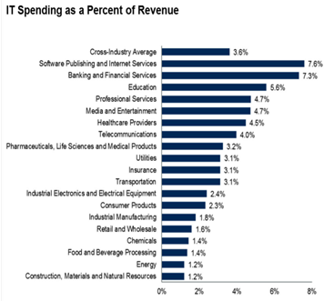
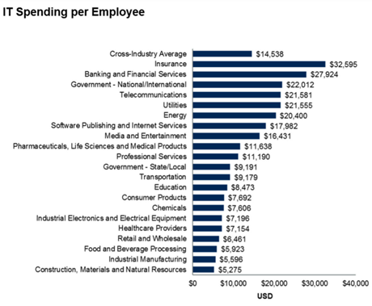

# CAF-Hackathon prerequisites

## Customer Scenario - Contoso Land Surveying

**Contoso Land Surveying** operates a global geology surveying business, where they deploy surveyors to carry out detailed land surveys for companies such as food producers, airports, oil companies, utilities, railway companies, ports authorities and other infrastructure heavy / reliant businesses. Surveys are carried out on dry land as well as underwater and in areas of variable terrain. They see an opportunity to leverage technology such as drones, data and AI to improve efficiency and provide deeper insight into surveys predicting challenges today and in the future for their clients and their use of land as an asset.
 
**Contoso basic information:**

- 8 countries, 5,500 employees, £1.3bn Revenue
- End state is a global IT system in the cloud which has minimum standards for:
  - Security; Compliance; Performance; Availability; Cost variability
- Enabling Contoso's Business Units to focus on core activities not keeping the lights on so they can downsize in house IT through use of cloud technologies, centralization, and automation
- Each country currently has autonomous IT with varying standards of DR, backup, and HA. Some countries will see cost savings from cloud others will see an increase as their IT is brought up to meet minimum standards, which were not harmonized prior to this move.
- Contoso has 173 Applications

Contoso's Senior Leadership Team (SLT) have already set the company direction to leverage technology to transform the business and now want a high level business case so they carry out a cost benefit analysis and ensure this key strategic move makes sense at this stage. Further depth in the business case will be built in later stages this is just a litmus test at this stage as the SLT look to release another round of funding.  

Contoso Land Surveying IT team have asked Microsoft to help develop a high-level feasibility study which examines the following:

- Move to cloud to enable innovation, avoid activities which 'keep lights on' focus on activities which differentiate (core vs context activities)
- Return on Investment
  - Must in payback in a 36-month period and lower overall OPEX
  - Cost of change must be paid for in 36-month period
- Business case needs to demonstrate this and consider business units where IT costs will increase & those where IT costs will decrease
- Benefits of Cloud must be clearly articulated
- Critical success factors must be clearly articulated
- High level business case required for CEO, CFO and SLT. To be delivered by CIO
- Optimise deployment of surveyors by automating their work as much as possible. This will give them a competitive advantage in an already commoditising business
- Leverage technology such as drones to optimise surveys & offer surveying solutions in areas not possible with people or conventional machines such as underwater, dangerous / hazardous environments or environments with limits on heavy equipment.

Additional possibly relevant information found from various sources:

### Estimate IT spend categories

Typically, these will be in this range:

- Data Centre 15 to 22% (lower if they have high cloud adoption)
- End User Compute 10 to 14% (lower if they have low EUC usage for example limited number of knowledge workers)
- Application Development 15 to 22% (lower if they predominantly use COTs applications and don't do much custom app dev)
- Application Support 19 to 22% (linked to above as well as complexity of applications, heavy ERP usage adds to cost)
- IT Service Desk 5 to 7%
- Voice & Data Networking 10 to 15% (influenced by number of branch locations and geography)
- IT Management, FG&A 8 to 12% (heavily offshore will lower these costs usually, but if there is lots of change offshore can be more expensive)

### Estimate cost savings from moving to cloud

- Try to find out how many applications they have
- Cost savings 500+ Applications likely to be in 25% range
- Cost savings for 300+ Applications likely to be in 20% range
- Cost savings for 150+ Applications likely to be in 15% range
- If not use 18% as a guesstimate
- The cost saving is derived most often from
- Switching off unused / duplicated applications
- Right Sizing the environment buy for what you need now not what you need in 3 years (cloud adoption mindset, not a capital purchase mindset you can easily upgrade along the way)
- Snoozing services out of hours, for example turning applications off during the evening and weekends can lower costs by at least a third

### Estimate the cost increase owing to countries needing to align infrastructure with new global standards

- The customer needs to provide information here, list the 8 countries, and get an anecdotal view of the state of their IT, as in this example
  - United Kingdom, 25% IT spend, aligned to global standards, no adjustment up needed
  - France, 18% IT spend, aligned to global standards, no adjustment up needed
  - Spain, 12% IT spend, aligned to global standards, no adjustment up needed
  - Italy, 15% IT spend, under specified, high adjustment
  - Portugal, 13% IT spend, aligned to global standards, no adjustment up needed
  - Belgium, 17% IT spend, under specified, medium adjustment
  - Netherlands, 14% IT spend, aligned to global standards, no adjustment up needed
  - Luxembourg, 8% IT spend, under specified, low adjustment
- Ask about the size of the investment this is usually a range of 5 to 15%
  - Low adjustment = 5%
  - Medium adjustment = 10%
  - High adjustment = 15%
- If this is impossible guess, and then show a trusted party and ask for their opinion. Use country revenue as a proxy for the IT spend (sometimes in the annual report)

### Estimate the cost of change

- The migration complexities and efforts result in a cost.  This cost relies on an understanding of the current infrastructure by performing a discovery and analysis. For the purposes of this challenge, we can estimate:
  - 5-to-8 times the anticipated monthly ACR as the cost of migration.  This excludes cost for application re-work which will need to be factored in. This range will depend on lift-and-shift efforts compared to modernization efforts.
  - These number should be validated with the partner supporting in the migration.
